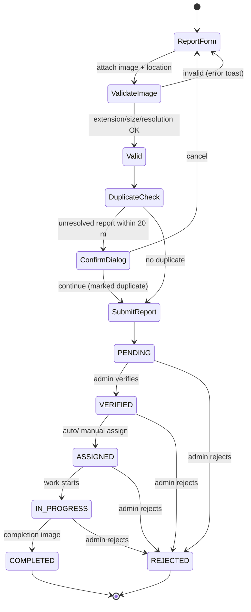
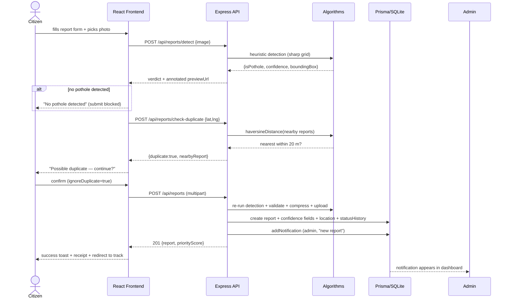
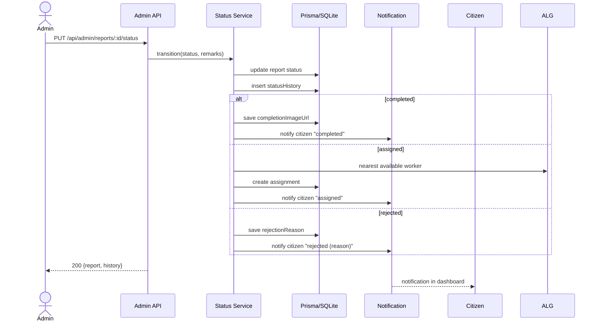
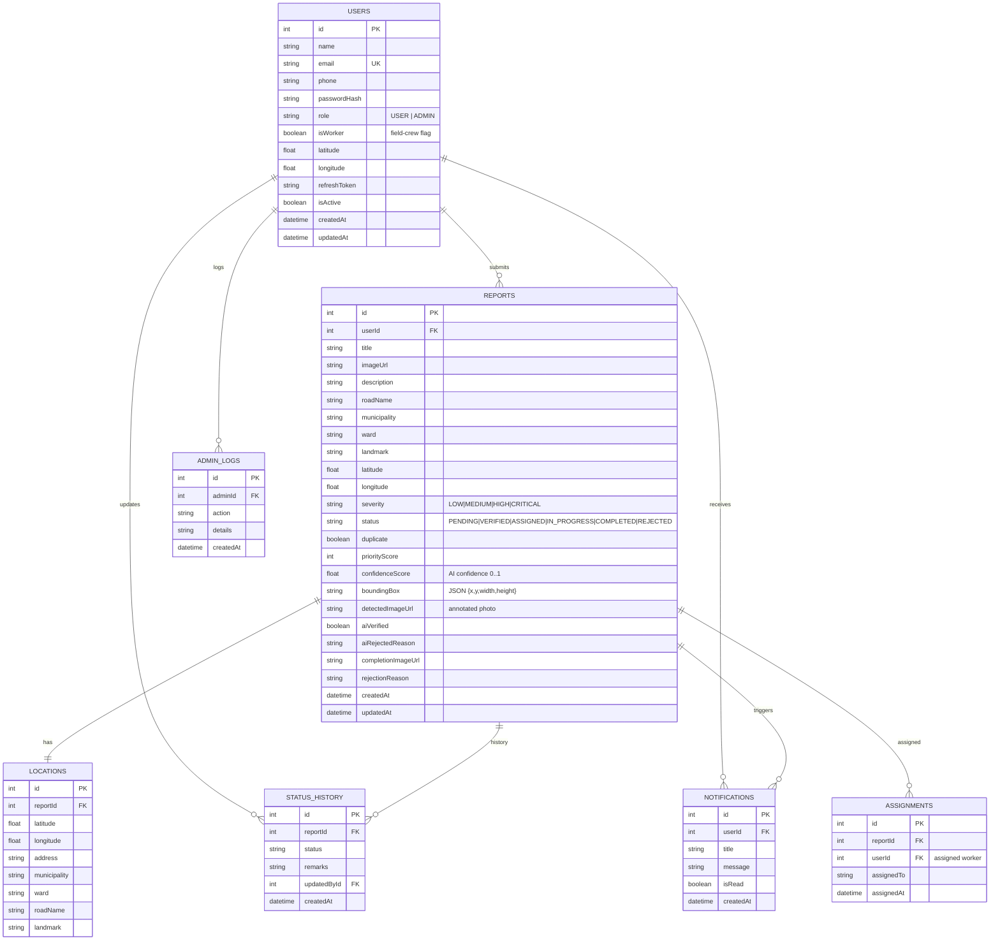
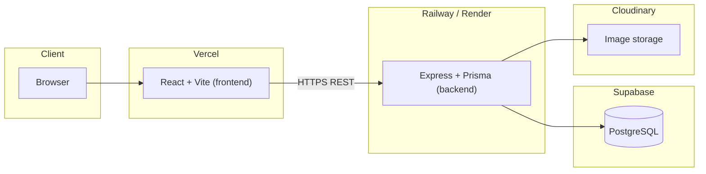

# Design Diagrams

All diagrams use [Mermaid](https://mermaid.js.org/) and render in GitHub, VS Code, or mermaid.live.

## 1. Use-Case Diagram

```mermaid
flowchart TD
  Actor Citizen["Citizen"]
  Actor Admin["Admin"]
  Actor Public["Public Visitor"]

  subgraph System["Smart Pothole Detection & Reporting System"]
    A1["Register / Login"]
    A2["Report a pothole (image + GPS)"]
    A3["Track report & timeline"]
    A4["Receive notifications"]
    A5["Download receipt"]
    A6["Edit profile"]
    A7["View public map & statistics"]
    A8["Contact support"]
    B1["Admin login (/admin)"]
    B2["View dashboard analytics"]
    B3["Verify / Reject report"]
    B4["Assign worker"]
    B5["Update status + completion image"]
    B6["Search / Sort / Filter reports"]
    B7["Export PDF / Excel / CSV"]
    B8["Manage users"]
  end

  Citizen --> A1 & A2 & A3 & A4 & A5 & A6
  Public --> A7 & A8
  Admin --> B1 & B2 & B3 & B4 & B5 & B6 & B7 & B8

  B3 --> A3
  B4 --> A3
  B5 --> A4
```

## 2. Activity Diagram — Report Lifecycle



## 3. Sequence Diagram — Report Submission



## 4. Sequence Diagram — Admin Status Change



## 5. Entity-Relationship (ER) Diagram



## 6. Deployment Topology


